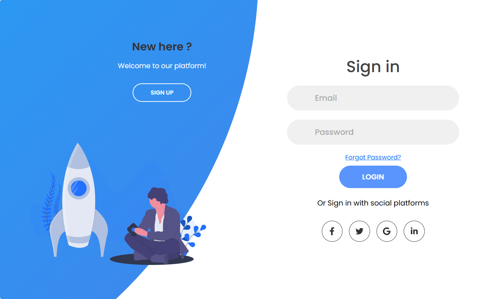
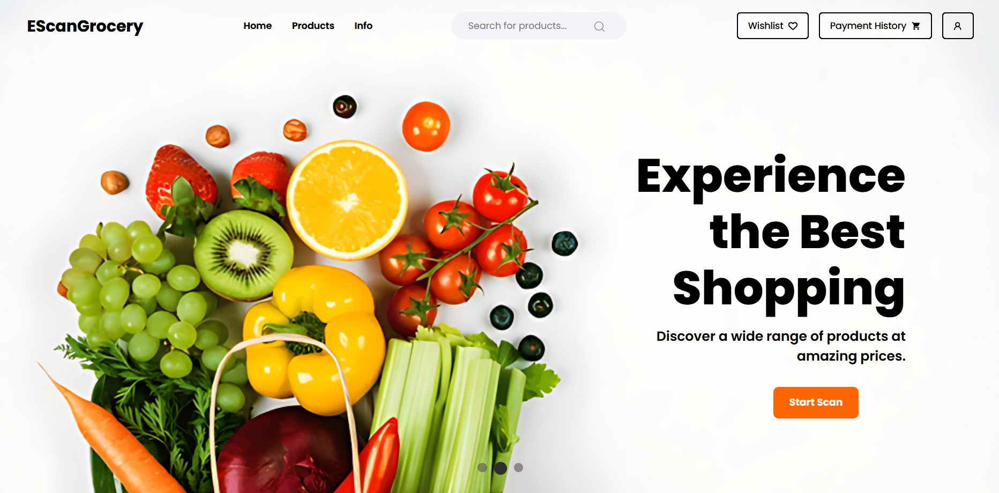
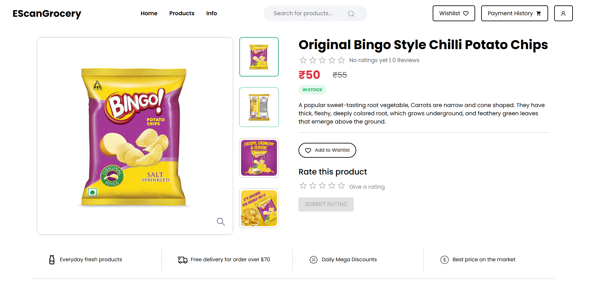
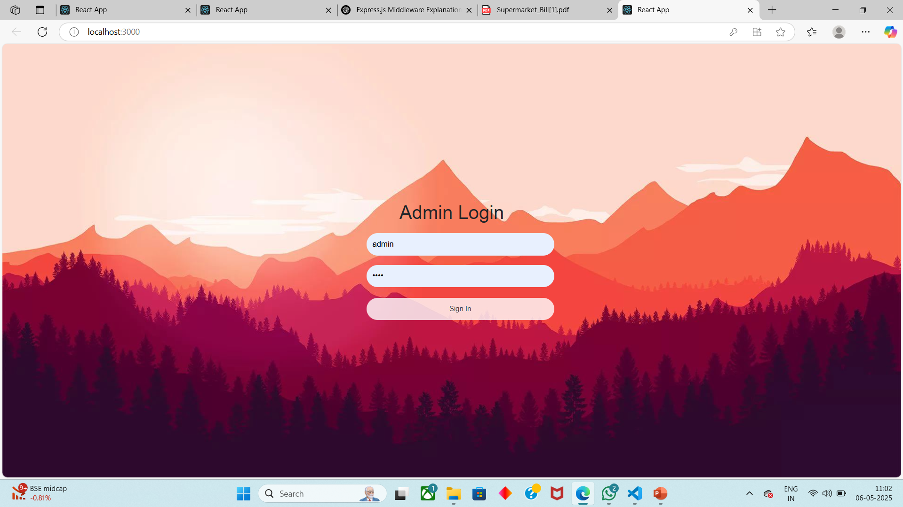
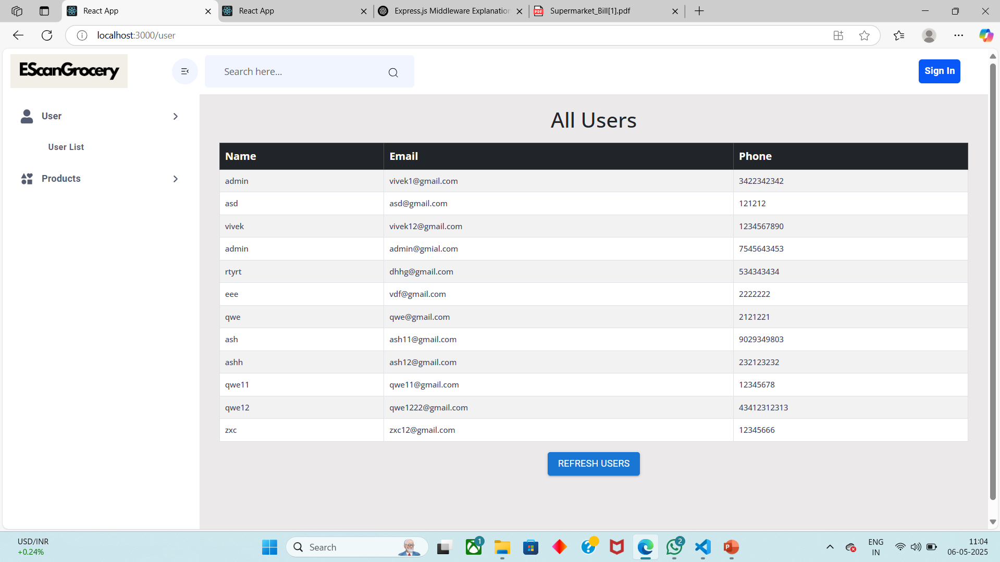
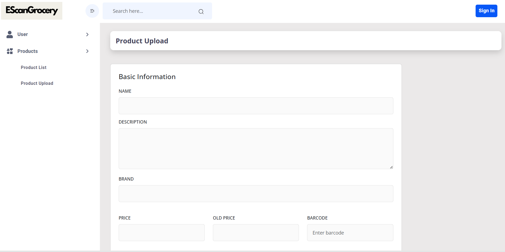
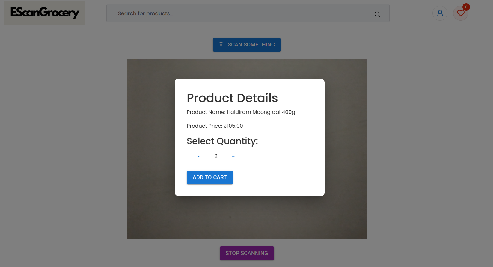
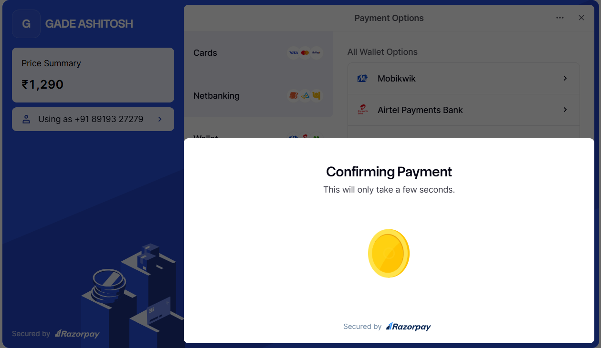
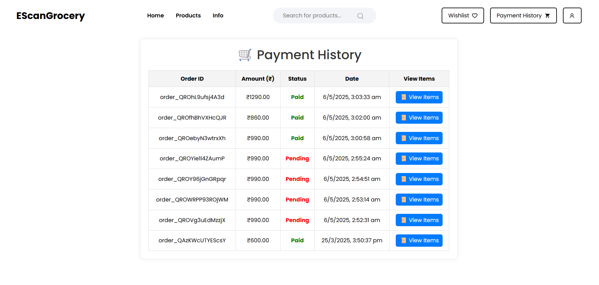

# 🛒 EscanGrocery – A Self-Billing Website

**EscanGrocery** is a web-based self-billing solution designed for supermarkets. It allows customers to scan products, generate bills, and make payments without needing cashier assistance. It also provides admin-level controls for managing users and inventory.

---

## 🚀 Features

### For Users:
- Login/signup securely
- Browse available products
- Scan barcodes using a phone camera
- Add products to a virtual cart
- Make payments through a payment gateway
- View payment history with downloadable receipts

### For Admins:
- Secure admin login
- View list of all registered users
- Upload and manage product listings

---

## 🖥️ Screenshots

### 🔐 1. User Login Page

> Allows users to sign up and log in to their account securely.

---

### 🏠 2. Home Page

> Displays latest announcements or offers and navigation options.

---

### 🛍️ 3. Product View Page

> Displays product details and photos.

---

### 🔐 4. Admin Login Page

> Separate login screen for admin with protected access.

---

### 👥 5. User List Page

> Admin view to see all registered users with basic info.

---

### 📦 6. Product Upload Page

> Admins can upload products with name, price, barcode and images.

---

### 📷 7. Barcode Scanning Page

> Users scan products directly using their phone’s camera. Detected items are added to cart automatically.

---

### 💳 8. Payment Page

> Summary of items in the cart, total price, and payment gateway integration for checkout.

---

### 📜 9. Payment History Page

> Lists all past orders with date, total amount, and PDF bills.

---

## 🛠️ Tech Stack

- **Frontend**: React.js, Bootstrap
- **Backend**: Node.js, Express.js
- **Database**: MongoDB
- **Barcode Scanning**: HTML5 camera + Barcode API (e.g., QuaggaJS)
- **Authentication**: JWT
- **PDF Generation**: jsPDF
- **Payment Integration**: Razorpay

---

🤝 Contributors
Gade Ashitosh
Baikadi Vivek Goud
Galib Amin

📄 License
This project is licensed under the MIT License.
